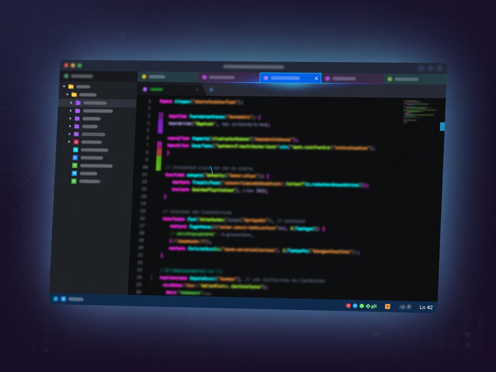
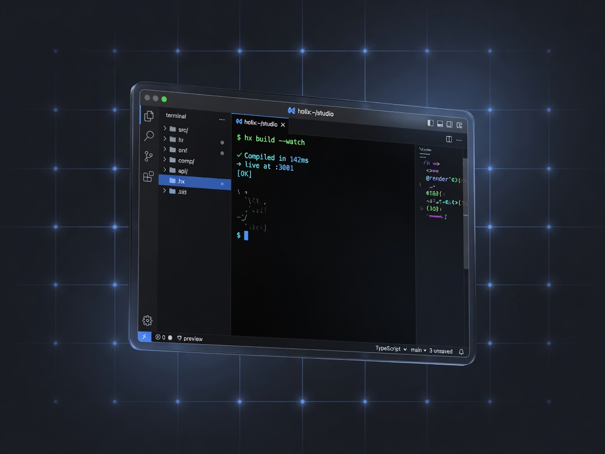

# Holix Studio CE

[](https://pypi.org/project/Holix/)
[](https://python.org)
[](LICENSE)
[](https://github.com/javded-itres/Holix)

Одноместная IDE для агента [Holix](https://github.com/javded-itres/Holix): чат, файлы, git и терминал **на вашей машине**. Один пользователь. Без облачной подписки.

Cloud для команд — [holix-studio.ru](https://holix-studio.ru). Этот репозиторий — витрина и установщик агента.

<p align="center">
  
</p>

**English:** [below](#english)

---

## Что это

| | **CE (здесь)** | **Cloud** |
|---|---|---|
| Кто | вы на своём компьютере | команда на holix-studio.ru |
| Пользователей | один | организации, инвайты, тарифы |
| Лицензия инстанса | не нужна | нужна |
| Репозиторий | эта витрина + [Holix](https://github.com/javded-itres/Holix) MIT | закрытый продукт |

CE — не «открытый GitLab». Исходники Cloud не лежат в этом git.

## Возможности

<p align="center">
  
  
  
</p>

- Агент Holix в браузере: чат, план, правки в workspace  
- Файлы, git, терминал  
- Свой ключ модели (OpenAI-совместимый / LiteLLM)

## Быстрый старт — агент Holix

Сейчас установщик ставит **агент** (MIT, PyPI). IDE CE подключается тем же профилем, когда выйдет релиз `holix-studio-ce`.

```bash
curl -fsSL https://raw.githubusercontent.com/javded-itres/holix-studio-ce/main/scripts/install.sh | bash
```

Или локально из клона:

```bash
git clone git@github.com:javded-itres/holix-studio-ce.git
cd holix-studio-ce
./scripts/install.sh
```

Нужны [uv](https://docs.astral.sh/uv/) и Python 3.12+. Дальше:

```bash
holix          # TUI агента
```

Ключ модели — в профиле Holix (`OPENAI_API_KEY` или LiteLLM). Документация: [Holix](https://github.com/javded-itres/Holix).

## Cloud

Команды, биллинг, франшиза: **[holix-studio.ru](https://holix-studio.ru)**

## Участие

- Баги установщика и тексты витрины — [Issues](https://github.com/javded-itres/holix-studio-ce/issues)  
- Агент, CLI, gateway — [javded-itres/Holix](https://github.com/javded-itres/Holix/issues)

Патчи к этому репо: docs и `scripts/install.sh`. См. [CONTRIBUTING.md](CONTRIBUTING.md).

## Лицензия

Витрина и скрипты — [MIT](LICENSE). Cloud Studio — отдельная source-available лицензия, сюда не входит.

---

## English

**Holix Studio CE** is a **single-user** IDE for the [Holix](https://github.com/javded-itres/Holix) agent: chat, files, git, and terminal **on your machine**. No cloud seat.

Teams use **[holix-studio.ru](https://holix-studio.ru)**. This repository is the public landing + Holix installer, not a dump of Cloud source.

```bash
curl -fsSL https://raw.githubusercontent.com/javded-itres/holix-studio-ce/main/scripts/install.sh | bash
holix
```

Requires [uv](https://docs.astral.sh/uv/) and Python 3.12+. Configure a model key in the Holix profile. The CE IDE build will ship as a GitHub Release on this repo; today the script installs the MIT **Holix agent**.
